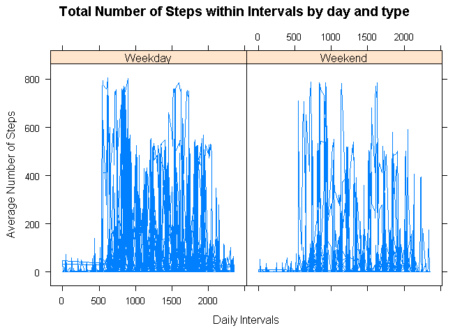

Loading Data
------------

``` r
knitr::opts_chunk$set(echo = TRUE)
knitr::opts_chunk$set(error = TRUE)
knitr::opts_chunk$set(warning = FALSE)
knitr::opts_chunk$set(dev="png")
#Set working directory
here <- getwd()
setwd(here)

#Download Data
get.data.project <- "https://d396qusza40orc.cloudfront.net/repdata%2Fdata%2Factivity.zip"
download.file(get.data.project,destfile="./repdata_data_activity.zip",method="auto")
unzip(zipfile="./repdata_data_activity.zip",exdir="./repdata_data_activity")
path_rf <- file.path("./repdata_data_activity")

library(ggplot2)

activity <- read.csv("./repdata_data_activity/activity.csv")

activity$date <- as.POSIXct(activity$date, "%Y-%m-%d")
```

    ## Warning in strptime(xx, f, tz = tz): unknown timezone '%Y-%m-%d'

    ## Warning in as.POSIXct.POSIXlt(x): unknown timezone '%Y-%m-%d'

    ## Warning in strptime(xx, f, tz = tz): unknown timezone '%Y-%m-%d'

    ## Warning in as.POSIXct.POSIXlt(x): unknown timezone '%Y-%m-%d'

    ## Warning in strptime(xx, f, tz = tz): unknown timezone '%Y-%m-%d'

    ## Warning in as.POSIXct.POSIXlt(x): unknown timezone '%Y-%m-%d'

    ## Warning in strptime(xx, f, tz = tz): unknown timezone '%Y-%m-%d'

    ## Warning in as.POSIXct.POSIXlt(x): unknown timezone '%Y-%m-%d'

    ## Warning in strptime(xx, f, tz = tz): unknown timezone '%Y-%m-%d'

    ## Warning in as.POSIXct.POSIXlt(x): unknown timezone '%Y-%m-%d'

    ## Warning in strptime(x, f, tz = tz): unknown timezone '%Y-%m-%d'

    ## Warning in as.POSIXct.POSIXlt(as.POSIXlt(x, tz, ...), tz, ...): unknown timezone
    ## '%Y-%m-%d'

``` r
weekday <- weekdays(activity$date)
```

    ## Warning in as.POSIXlt.POSIXct(x, tz): unknown timezone '%Y-%m-%d'

``` r
activity <- cbind(activity,weekday)

summary(activity)
```

    ## Warning in as.POSIXlt.POSIXct(x, tz): unknown timezone '%Y-%m-%d'

    ##      steps             date               interval        weekday         
    ##  Min.   :  0.00   Min.   :2012-10-01   Min.   :   0.0   Length:17568      
    ##  1st Qu.:  0.00   1st Qu.:2012-10-16   1st Qu.: 588.8   Class :character  
    ##  Median :  0.00   Median :2012-10-31   Median :1177.5   Mode  :character  
    ##  Mean   : 37.38   Mean   :2012-10-31   Mean   :1177.5                     
    ##  3rd Qu.: 12.00   3rd Qu.:2012-11-15   3rd Qu.:1766.2                     
    ##  Max.   :806.00   Max.   :2012-11-30   Max.   :2355.0                     
    ##  NA's   :2304

1. What us the mean total number of steps taken per day?
--------------------------------------------------------

``` r
activity_total_steps <- with(activity, aggregate(steps, by = list(date), FUN = sum, na.rm = TRUE))
names(activity_total_steps) <- c("date", "steps")
hist(activity_total_steps$steps, main = "Total number of steps taken per day", xlab = "Total steps taken per day", col = "darkblue", ylim = c(0,20), breaks = seq(0,25000, by=2500))
```


Total number of steps per day:

``` r
mean(activity_total_steps$steps)
```

    ## [1] 9354.23

Median number of steps per day:

``` r
median(activity_total_steps$steps)
```

    ## [1] 10395

2. What is the average daily activity pattern?
----------------------------------------------

``` r
average_daily_activity <- aggregate(activity$steps, by=list(activity$interval), FUN=mean, na.rm=TRUE)
names(average_daily_activity) <- c("interval", "mean")
plot(average_daily_activity$interval, average_daily_activity$mean, type = "l", col="darkblue", lwd = 2, xlab="Interval", ylab="Average number of steps", main="Average number of steps per intervals")
```


Which 5-minute interval, on average across all days, contains the most
steps?

``` r
average_daily_activity[which.max(average_daily_activity$mean), ]$interval
```

    ## [1] 835

3. Imputing missing values
--------------------------

There are a number of days/intervals where there are missing values
(coded as NA). The presence of missing days may introduce bias into some
calculations or summaries of the data.

Calculate and report the total number of missing values in the data set.

``` r
sum(is.na(activity$steps))
```

    ## [1] 2304

Devise a strategy for filling in all of the missing values in the data
set.

``` r
imputed_steps <- average_daily_activity$mean[match(activity$interval, average_daily_activity$interval)]
```

Create a new data set that is equal to the original data set but with
the missing data filled in.

``` r
activity_imputed <- transform(activity, steps = ifelse(is.na(activity$steps), yes = imputed_steps, no = activity$steps))
total_steps_imputed <- aggregate(steps ~ date, activity_imputed, sum)
names(total_steps_imputed) <- c("date", "daily_steps")
```

Make a histogram of the total number of steps taken each day and
Calculate and report the mean and median total number of steps taken per
day.

``` r
hist(total_steps_imputed$daily_steps, col = "darkblue", xlab = "Total steps per day", ylim = c(0,30), main = "Total number of steps taken each day", breaks = seq(0,25000,by=2500))
```


Total steps per day:

``` r
mean(total_steps_imputed$daily_steps)
```

    ## [1] 10766.19

Median steps per day:

``` r
mean(total_steps_imputed$daily_steps)
```

    ## [1] 10766.19

4. Are there differences in activity patterns between weekdays and weekends?
----------------------------------------------------------------------------

Create a new factor variable in the data set with two levels weekends
and weekdays indicating whether a given date is a weekday or weekend
day.

``` r
activity$date <- as.Date(strptime(activity$date, format="%Y-%m-%d"))
activity$datetype <- sapply(activity$date, function(x) {
        if (weekdays(x) == "Monday" | weekdays(x) =="Sunday") 
                {y <- "Weekend"} else 
                {y <- "Weekday"}
                y
})
```

Make a panel plot containing a time series plot of the 5-minute interval
(x-axis) and the average number of steps taken, averaged across all
weekday days or weekend days (y-axis).

``` r
library(lattice)
plot<- xyplot(activity$steps ~ activity$interval | activity$datetype,
              type = "l",
              main = "Total Number of Steps within Intervals by day and type",
              xlab= "Daily Intervals",
              ylab= "Average Number of Steps",)
print(plot)
```


